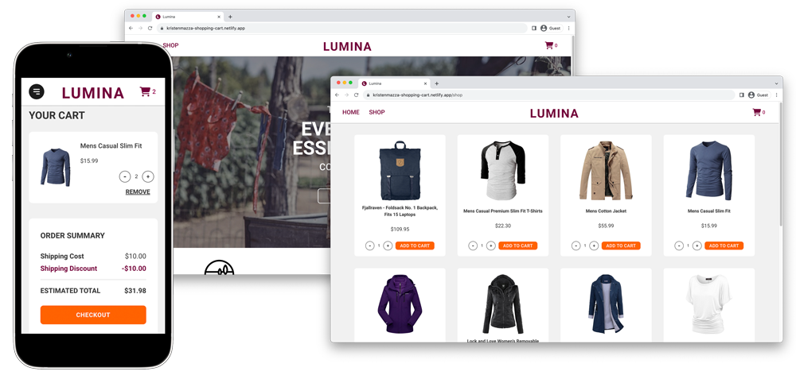

# Lumina: A Shopping Cart Project
Lumina serves as a prototype for an online store specializing in everyday clothing and accessories. Browse products, determine your desired product quantity, and add the items to your cart.

[Live Demo](https://kristenmazza-shopping-cart.netlify.app/) :point_left:

## Learning Objectives
The primary objectives behind this project were to gain hands-on-experience using React Router, fetching data in React, and conducting UI element testing using Vitest (a testing framework) and React Testing Library.

## Setup Instructions
1. Install dependencies using `npm install`
2. Use `npm run dev` to start dev server and run the application in development mode
3. Use `npm run build` to build the app. The app can then be tested locally by using `npm run preview`

## Credits
- Product data and product images were retrieved from [Fake Store API](https://fakestoreapi.com/)
- Additional images were designed by [Freepik](www.freepik.com)